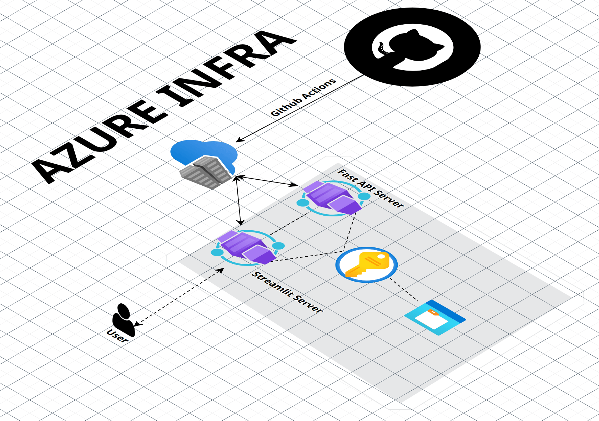

# docker-compose-ci-cd-practice1
#
# Chatbot Image Recognition

This project is a chatbot that recognizes images and answers questions related to them. It is containerized using Docker, deployed on Azure, and uses CI/CD with GitHub Actions.

## Architecture

- **FastAPI**: Container that handles image recognition via an API.
- **Streamlit**: Container that serves as the frontend chatbot interface.
- **Azure**:
  - **Container Registry**: Stores Docker images.
  - **Key Vault**: Manages sensitive data.
  - **Storage Account**: Stores user-uploaded images.

## Setup

1. **Azure Resources**:
   - Create an **Azure Container Registry** for storing images.
   - Set up **Azure Key Vault** for managing secrets.
   - Create a **Storage Account** for images.
   - Set up **Azure Container Apps** for FastAPI and Streamlit containers.

2. **Build and Push Docker Images**:
   - Build the Docker images for FastAPI and Streamlit.
   - Push images to the Azure Container Registry.

3. **CI/CD Pipeline**:
   - Use **GitHub Actions** to automate:
     - Docker image builds.
     - Pushing images to Azure.
     - Deploying to Azure Container Apps.

## CI/CD with GitHub Actions

- **Login to Azure** using OIDC.
- **Build and Push Docker Images** to Azure Container Registry.
- **Deploy to Azure Container Apps** using the Azure CLI.

## Key Vault & Storage

- Store API keys and other secrets in **Azure Key Vault**.
- Store uploaded images in **Azure Blob Storage**.

## URLs and Endpoints

- **FastAPI**: `/upload_image/` for uploading images, `/image_recognition/` for image processing.
- **Streamlit**: Frontend app, interacts with FastAPI for image recognition.

## Deployment

After deployment, update the **Streamlit** URLs to point to the public **FastAPI URL** for communication.



```python
UPLOAD_IMAGE_URL = "<FASTAPI_PUBLIC_URL>/upload_image/"
IMAGE_RECOGNITION_URL = "<FASTAPI_PUBLIC_URL>/image_recognition/"

